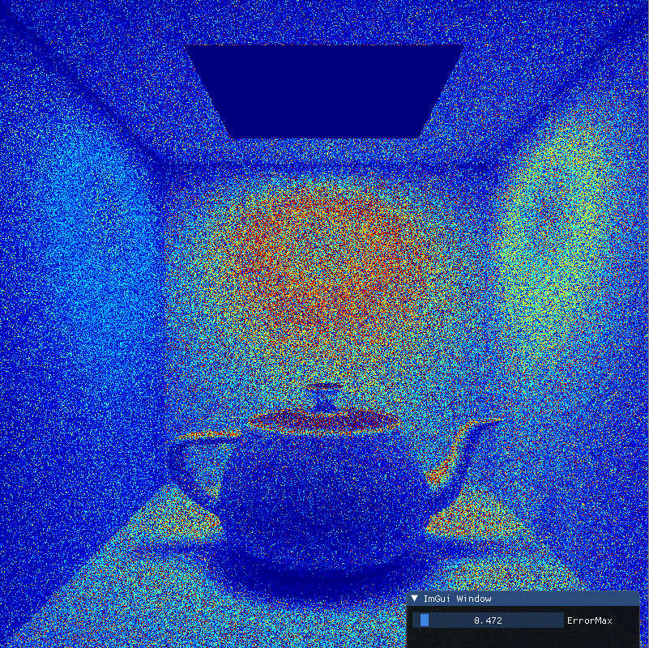


# 概要

Xitils は、レイトレーシング関連の論文などを実装してみるための包括的なライブラリ (になる予定のもの) です。
現状では、シンプルなレイトレーサーとそれを使って論文などを実装したプロジェクト群が含まれています。

最終的には多変数関数のテーブル化とか球面分布関数の近似などよく使う機能を一通り網羅できるのが目標ですが、
さしあたっては、自分が必要になったときに必要になった分だけ機能を追加するという原則で更新しています。
具体的には、Xitils を使って論文などを実装してみたプロジェクト群 (Sandbox プロジェクト) があり、
その実装中に必要になった場合に Xitils に機能が追加されます。
また、Xitils 側ではなく個別のプロジェクトに対して書かれたコードについても、
一般に使えそうだった場合は後で Xitils 側に吸い上げられます。

# ビルド・実行方法

## 推奨環境

- 言語: C++17
- CPU: AVX2 対応
- OS + IDE: Windows + Visual Studio (特に VS 2019で動作確認)
- CMake: Version 3.8 以上

OS と IDE の環境依存については CMake での一部ビルドオプション設定を VS 用にベタ書きしているだけなので、
そこだけ直せば他の環境でも普通に使えると思われます。

## ビルド方法

1. CMake 3.8 以上をインストール | https://cmake.org/
2. サブモジュールを取得 | ```git submodule update --init --recursive```
3. Build フォルダ内で CMake を実行 | ```cmake ..```
4. 生成された VS ソリューションファイルからビルドを実行

## 実行手順

### 画像ファイルのダウンロード
Sandbox プロジェクトが使用する画像ファイルなどは `Sandbox/Data/` フォルダに含まれていますが、
配布元にて再配布可能と明記されていないファイルについては含めていません。
そのため、一部プロジェクトが使用するファイルは適宜個別にダウンロードして `Sandbox/Data/` 内に置く必要があります。

- IBL 用イメージファイル `rnl_probe.hdr` | http://www.pauldebevec.com/Probes/
  - プロジェクト `Microfacet-basedNormalMapping` が使用

なお、すでに `Sandbox/Data/` に含まれているテクスチャファイルについては、以下のサイトのものを使用しています。 | https://3dtextures.me/

### 実行
`Sandbox/Data/` を実行ディレクトリとして、ビルドした実行可能ファイルを起動します。
CMake で生成した VS 用ソリューション経由で実行可能ファイルを起動すれば、自動的に上記のとおり実行されます。

# Xitils の各クラスの概要
[Xitils の各クラスの概要](Documents/Xitils.md)

# メモ

## 著作権情報
`CMake/` 内のファイル、また `ThirdParty/` 内のライブラリは、
Xitils が依存する別のプロジェクト群に帰属するものです。
個々の著作権情報については各ソースファイル中に記載されているのでそれを参照してください。

## stb への修正点
Cinder と stb をそのまま併用するとエラーが出るので、回避策として `ThirdParty/stb/stbi_image.h` の 5099 行目
```
void stbi__tga_read_rgb16(stbi__context *s, stbi_uc* out)
```
を
```
static void stbi__tga_read_rgb16(stbi__context *s, stbi_uc* out)
```
に変更しています。

参考 | https://github.com/cinder/Cinder/issues/1743

## Misc
- Xitils は左手座標系を採用しています。 (ポリゴンは反時計)
- テクスチャ座標系については、U は右方向、Vは下方向です。
- F1 を押すと実行ディレクトリにスクリーンショット `screenshot.png` が保存されます。
- 既知のバグなど
    - エラー処理ちゃんと行ってないので例えばファイルが読めなかったりすると普通に落ちます。(修正予定)
    - F12 を押すと落ちる？
    - 画面サイズ変えまくると落ちます。


# Sandbox プロジェクト

## SimpleWindow


- 簡単な画像をアニメーション表示するウィンドウを出す
- UI に表示されている値を操作すると表示されている円のサイズや位置が変わる
- 直接画面に円を描画しているのではなく、一旦画像バッファに円を描画してからその画像を画面に表示している
  - 画像の更新と表示は別スレッドに分かれていて、画像の更新処理が重くても UI の操作はもたつかない
  - 画像の更新部分は CPU で行われており、後々レイトレーシングなどを行うのを想定している
  - 画像の表示部分は OpenGL

## SimplePathTracer


- シンプルなパストレーサーで Cornell Box をレンダリングする
  - NEE + BRDF Sampling の MIS を使ったパストレ

## VonMisesFisherDistribution


- von Mises-Fisher Distribution で球面分布を近似する

## VisualizeError


- 画像を 2 つ選択し、それらの二乗誤差をビジュアライズする

## MicrofacetBasedNormalMapping


左: ナイーブなノーマルマッピング \
右: 提案手法 (tangent facet は same material)

[Microfacet-based Normal Mapping for Robust Monte Carlo Path Tracing [Schüssler 2017]](https://blogs.unity3d.com/jp/2017/10/02/microfacet-based-normal-mapping-for-robust-monte-carlo-path-tracing/)
を実装したもの。
物理的に破綻のないノーマルマッピングのモデルを提案しています。

この論文を読んだ際の解説記事を以下にアップしてあります。 \
[Microfacet-based Normal Mapping for Robust Monte Carlo Path Tracing - 水鳥コンビナート](http://mizuooon.hatenablog.jp/entry/microfacet-based-normal-mapping-for-robust-monte-carlo-path-tracing)

使用する描画モデルはソースコード中の定数
```
const _MethodMode MethodMode = MethodModeProposed;
```
を書き換えることで変更できます。

- MethodModeNaive: 通常のノーマルマッピング
- MethodModeProposed: 論文で提案されているノーマルマッピング

また、以下の定数
```
const _TangentFacetMode TangentFacetMode = SameMaterialExplicit;
```
を書き換えることで、MethodModeProposed 使用時の tangent facet に適用するシェーディングモデルを変更できます。
- SameMaterialExplicit: ベースとなるマテリアルと同じものを使用
- SpecularExplicit: スペキュラ鏡面を使用

ローカルリフレクションの解析的な反射モデルについては、
理論を理解する上でそこまで重要ではなさそうだったので実装は省略しています。

## PrefilteringForRenderingDisplacementMappedSurfaces


左上: リファレンス \
右上: 低解像度ディスプレースメントマップを使用 \
左下: 低解像度ディスプレースメントマップに vMF 分布で近似した NDF を組み合わせたもの\
右下: 提案手法 \
(オリジナルのテクスチャ は 1024x1024、ダウンサンプリング後は 128x128)

[Accurate Appearance Preserving Prefiltering for Rendering Displacement-Mapped Surfaces [Wu 2019]](https://winmad.github.io/) 
を実装したもの。
ディスプレースメントマップをダウンサンプリングした際に
シャドーイング・マスキング効果やそれに付随する局所散乱効果が低下し見た目が変化してしまう問題について、
スケーリング関数を用いて上記効果の補償を行うことで元の見た目を保つようにする方法を提案しています。

この論文を読んだ際の解説記事を以下にアップしてあります。 \
[Accurate Appearance Preserving Prefiltering for Rendering Displacement-Mapped Surfaces - 水鳥コンビナート](http://mizuooon.hatenablog.jp/entry/accurate-appearance-preserving-prefiltering-for-rendering-displacement-mapped-surfaces)

使用する描画モデルはソースコード中の定数
```
const _MethodMode MethodMode = MethodModeProposed;
```
を書き換えることで変更できます。

- MethodModeReference: リファレンスとして、オリジナルの解像度のディスプレースメントマップを使用して描画
- MethodModeNaive: ダウンサンプリングしたディスプレースメントマッピングを使用して描画
- MethodModeMultiLobeSVBRDF: ダウンサンプリングしたディスプレースメントマッピングに vMF 分布で近似した NDF を組み合わせて描画
- MethodModeProposed: 論文で提案されている方法

ディスプレースメントマッピングは論文中と同じようにシェルマッピングを使用して描画しています。

### 事前計算について
MethodModeProposed を使用すると、前処理としてシャドーイング・マスキング効果を補償する Scaling function の計算を行います。
これにはおよそ 20 ～ 30 分くらいかかります。
事前計算済みデータの保存や読み込みは今の所対応していません。

### テクスチャダウンサンプリング時の正規化項について
テクスチャのダウンサンプリング時、
論文中では正規化項を使ってダウンサンプリング後のテクスチャのデコボコを抑えるようにしていますが、
本実装では今の所その正規化項の実装は省略しています。

論文中のようにオリジナルのテクスチャがかなり高解像度 (4K 程度) で、
ダウンサンプリング後でもそれなりの解像度がある場合でなければ
それほどデコボコが問題にはならないと考えられ、
自分の実験環境では影響が少ないと判断しました。

### 実効 BRDF の測定について

事前計算中での実効 BRDF の測定について、
論文で記載されているように布表面の位置を直接サンプリングする方法だと自分の環境では何故かあまり精度が出なかったので、
視線方向から明示的にレイキャストをして測定するようにしています。
速度的にもそこまで変わらなさそうだったのでそちらをデフォルトにしていますが、以下のマクロ
```
#define SAMPLE_P_WITH_EXPLICIT_RAYCAST
```
をコメントアウトすると布表面の位置を直接サンプリングする方法に切り替えることもできます。

### その他メモ
- ディスプレースメントマッピングの実装は論文中と同様にシェルマッピングを使用しています。
- 関数のテーブル化についての解像度や、実効 BRDF 測定時のサンプル数は論文中よりも少なめにとってあります。
    - それでも論文と同じくらい前処理の時間かかっていたので実装が悪い気もする。
    - 実効 BRDF の明示的なレイキャストでの測定で速度が落ちている訳ではなさそう。
- 論文と本実装では、角度を引数とした関数をテーブル化する際に使う角度のマッピングが少し異なっています。
    - 論文中では concentric mapping で半球を 1x1 サイズの二次元平面にマッピング
    - 本実装では方位角と極角を軸として二次元平面にマッピング
    - 本質的な違いは無いがテーブルの解像度を論文中と同等にして試したい場合には注意が必要


